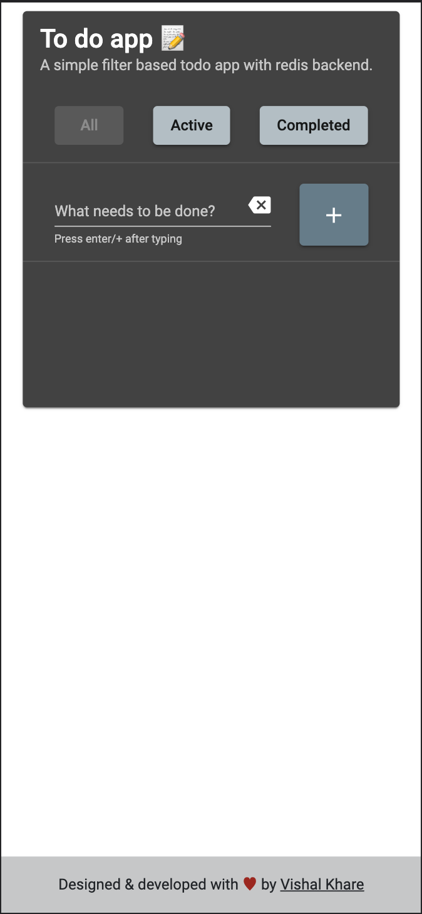

# Todo app with Redis backend.


[Demo app](http://13.235.106.236/redis-todo) || 
[Postman collection for deployed backend](https://www.getpostman.com/collections/644a5723b4e630b7c87b)
### Description
A simple todo app with redis backend. Frontend is an angular application and backend is a python flask application.

### Screenshots
|   |   |   |
|---|---|---|

### Video explainer
[](https://www.youtube.com/watch?v=uDytA3TNrNM)
### Local setup
We will run angular and flask applications on 2 separate terminals.

#### Pre-requisites
1. python 3.7
2. node
3. redis (with RediSearch module installed)

#### Setting redis endpoint
This project uses `redis-om` to interact with redis. It uses RediSearch module to save data as native JSON objects.
Set your redis endpoint as environment variable using this command-
```bash
export REDIS_OM_URL=http://localhost:6379
```

#### Terminal 1 (Running python flask app)
```bash
git clone https://github.com/iamvishalkhare/todoapp.git
cd todoapp
pip install -r requirements.txt
flask app
```
Backend should up and running on `http://127.0.0.1:8000`

#### Terminal 2 (Running angular front end)
```bash
cd todoapp
npm install
ng serve
```
Angular frontend should now be up and running on `http://127.0.0.1:4000`


